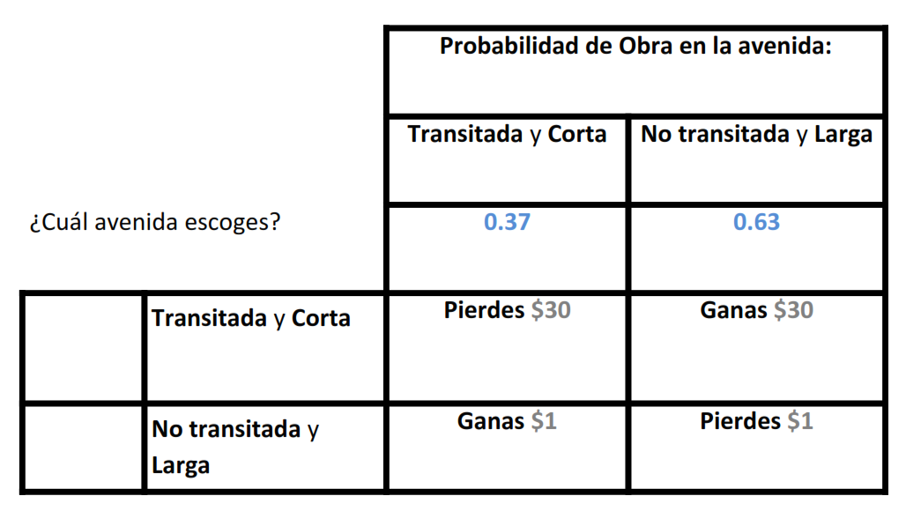
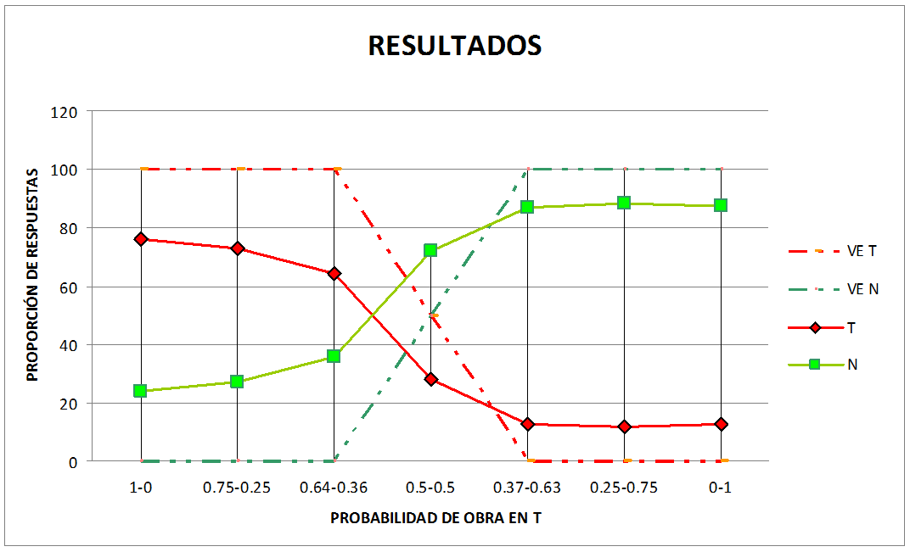
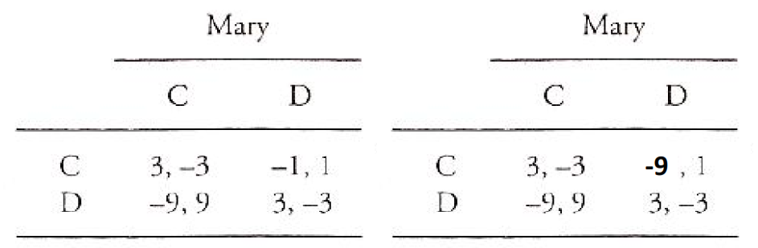
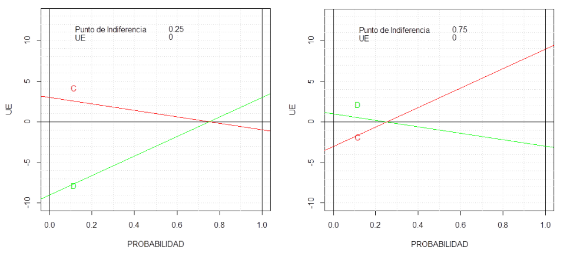
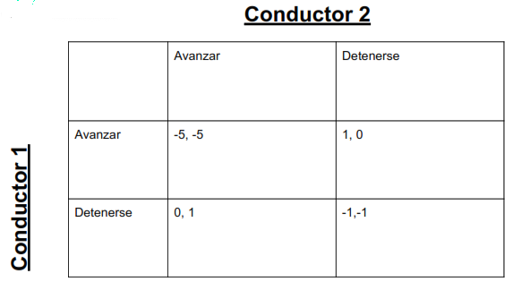
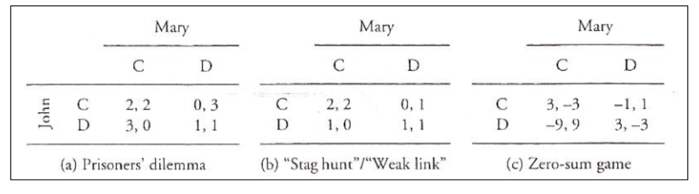
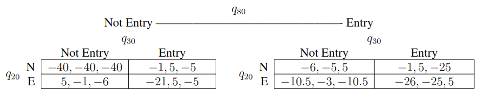
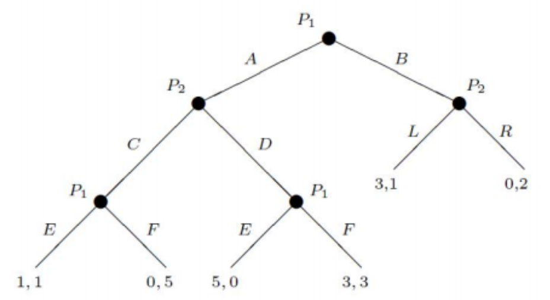
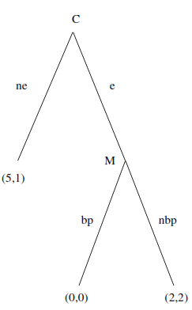
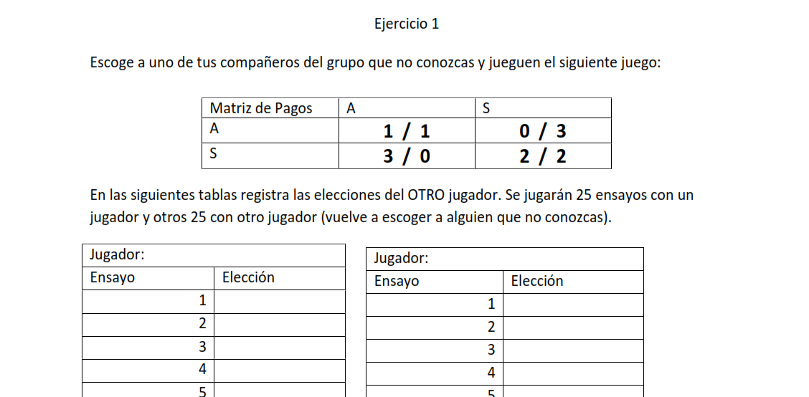

```{r setup, include=FALSE}
knitr::opts_chunk$set(echo = FALSE)
```

# Componentes de un juego

Los juegos buscan ser una representación de las circunstancias donde se desarrollan interacciones entre varios jugadores.

Quizá debería llamarse: **Teoría de la decisión en intercción**

¿Qué situación podríamos modelar con teoría de Juegos?

* Tráfico
* Matrimonio
* Juegos de mesa

----

## Jugadores

Se denotará al conjunto de jugadores como:
$$N= \{ 1, 2, ..., n \}$$

----


## Acciones

Se denotará al conjunto de acciones del jugador $i\in N$ como: $S_i$
, y al conjunto de posibles acciones como: $S = S_1\times ...\times S_n$

----


## Funciones de Pago

Se denotará a la función de pago del jugador $i$ como: 
$$\pi_i: S \rightarrow \mathbb{R}$$
Esta función de pago es la característica fundamental para definir un juego sobre otro, pues encierra las propiedades fundamentales de la situación de interacción que se busca modelar.

----

# Axiomas de Von Neumann-Morgenstern

* Completitud: 
$A\succsim B \text{ o } B\succsim A$

* Transitividad
$\text{Si } A\succsim B \text{ y} B\succsim C \Rightarrow A\succsim C$ 

* Independencia:
$\text{Si } A\succsim B \Rightarrow \alpha(A)+(1-\alpha)C \succsim \alpha(B) + (1-\alpha)C \text{, } \forall \alpha \in [0, 1]$

* Continuidad:
$\forall A, B, C$, los conjuntos:
$$\{ \alpha: \alpha (A) + (1-\alpha) B \succsim C \}$$
$$\{ \alpha:  C \succsim \alpha (A) + (1-\alpha) B \}$$
, son cerrados.

Son estos axiomas se puede demostrar la existencia de una función de utilidad esperada von Neumann-Morgenstern (Teorema de la utilidad esperada).

----

## Teorema de Utilidad Esperada

----

## Exitencia de Creencias

La existencia de una función de utilildad que admite la forma de utilidad esperada permite tambien encontrar la probabilidad que un agente tiene sobre un evento. 

1. Supongamos $L\succ L' \succ L'' \iff U(L)>U(L')>U(L'')$, y  usemos la notación: $U(L')=u' \in \mathbb{R}$

2. Entonces, tenemos que: $\exists \alpha, \text{ tal que} , \alpha(u) + (1-\alpha)(u'') = u'$

* Si tenemos que $\nexists \alpha$ que cumpla 2., supongamos sin perdida de generalidad que $\alpha(u) + (1-\alpha)(u'') < u', \forall \alpha$

* Notemos primero que $\exists \epsilon, \text{ tal que}, u'=u+\epsilon<u''$

* Entonces, $u'\in (u,u'')=\{\alpha(u) + (1-\alpha)(u'') | \alpha\in (0,1) \}$

En particular, tenemos que si $\alpha = \frac{u+\epsilon/2 - u''}{u-u''}$, llegamos a contradicción.

----

## Estudio de decisión unipersonal

En estas situaciones se asume que se juega contra la naturaleza. En economía son llamados modelos de Robinson Crusoe por que tratamos de entender las conductas de un ser humano en completo aislamiento. 

La Teoría de juegos hace más interesante el análisis, permitiendo considerar las interacciones. Sin embargo, este modelo es fundamento de los modelos que se consruyen posteriormente.

----

### Ejemplo Empírico



----

### Resultados



----

## Supuestos adicionales de la Teoría de Juegos

Podríamos encontrar cuales son las utilidades que representan este patrón.

Sin embargo,se suele trabajar bajo el supuesto de que los pagos monetarios representan las utilidades de las personas como una simple transformación lineal.

----

# Estrategias mixtas

Tenemos una generalización de las estrategias de los jugadores como distribuciones de probabilidad sobre las estrategias que llamaremos $\sigma_i: S_i\rightarrow \mathbb{R}$, talque:

* $\sigma_i(s_i) \geq 0$

* $\sigma_i(S_i) = 1$

* $\sigma_i(s_i | s_i')= \sigma_i(s_i)+\sigma_i(s_i'), \text{ si } s_i \neq s_i'$

Nótese que estamos definiendo una medida de probabildiad sobre el conjunto de estrategias de $i$.

Conjunto de posibles estrategias mixtas dentro del juego:
$\Sigma = \Pi_{i=1}^N\Sigma_i$


----

## Pagos Esperados

Calcular el pago esperado del jugador $i$ por su estrategia $\sigma_i$ es directo:
$$U_i(\sigma\in\Sigma)=\Sigma_{s\in S}p(s)\pi_i(s)$$
Bajo el supuesto de independencia entre las estrategias de los jugadores tenemos que: $p(s)= \sigma_1(s_1)X...X\sigma_n(s_n)$, recordando que $s=(s_1, ..., s_n)$, con $s_i\in S_i$


----



----

## Pagos Esperados y Estrategias Mixtas

Bajo diferentes probabilidades de respuesta de los otros participantes hay un pago esperado diferente por esta estrategia mixta. Como se suponen los pagos como una representación de la utilidad, tenemos que los participantes prefieren siemprela estrategia con la mayor utilidad esperada asosiada.



----

## Mejores Respuestas

$$\sigma_i^{BR}(\sigma_{-i}) = \{\sigma^*_i\in\Sigma_i|U_i(\sigma^*_i,\sigma_{-1})\geq U_i(\sigma_i,\sigma_{-1}), \forall \sigma_i \in\Sigma_i\}$$

Esta función se puede interpretar como las preferencias de un jugador sobre sus estrategias dada la creencia que tiene sobre las estrategias de los demás.

----

# Representación de los Juegos

La notación antes mencionada es estándar, pero cada autor y, sobre todo, cada problema pueden tener cierta forma de expresar los anteriores elementos de formas diferentes. Sin embargo, los elementos $<N,\{S_i\},\{\pi_i\}>$ están en todos los juegos. 

Existen dos grandes formas de representar los juegos: 

* Rectangulares
* Extensivos

----

## Juegos Rectangulares (forma normal)



# Juegos Clásicos



# Problemas de Representación

El tratamiento de las situaciones de interacción en la teoría de juegos se entiende con la representación de juegos matriciales 2x2 (los más sencillos). 
Además, estos juegos proveen muchas de las intuiciones básicas de la teoría.
Sin embargo, muchas situaciones pueden complicarse. Por ejemplo:

* Gran Número de jugadores
* Acciones dentro de un intervalo
* Estructura condicional de las acciones

----


### Tres jugadores


----

----


## Juegos Extensivos


----

----


### Ejercicio

El juego de un periodo de la cadena de supermercados
de Selten. (Una amenaza increíble). La empresa M, una cadena de
supermercados, tiene el control sobre cierto producto, lo monopoliza, pero
existe la posibilidad de que una empresa C decida entrar a competir a dicho
mercado. M intentará convencer a C de que no lo haga, prometiéndole a
cambio un millón de pesos de los seis que ella obtendría sin competidor y
amenazándola, además, con bajar los precios si, a pesar de todo, C decidiera
entrar a la competencia. Supongamos que llegara a ocurrir esto último, es
decir, C hizo caso omiso del peligro que corre. De cumplir M su palabra,
ninguna de las dos empresas obtendr´ıa ganancia alguna, en cambio, si M
no cumple su amenaza, las ganancias de cada uno serán de dos millones.

(Tomado de Zapata, 2007)

----


#### Solución


----

----


## Ejemplo empírico



# Datos experimentales. ¿Qué esperearíamos?
```{r,echo=FALSE}
E1 <- read.csv("data/EJERCICIO1.csv")
e1=E1[,-1] # quitamos los indicadores de ensayo
head(e1[,1:2])
#dim(e1) # tenemos 25 ensayos y 44/2 = 22 parejas
soles= rowSums(e1)/length(e1[1,]) # proporción de soles en cada ensayo
```

-----

# Comportamiento en el tiempo
```{r, echo=FALSE}
plot(soles,ylim=c(0,1), ylab= "Soles", xlab="Ensayos", col="blue")
adjline <- line(1:25,soles)
abline(adjline, col="blue")
```

-----


# Comportamiento por tipo de jugador
```{r,echo=FALSE}
# separate groups by type
soles2= rowSums(e1[,(1:44 %% 2 ==0)])/length(e1[,(1:44 %% 2 ==0)])
soles1= rowSums(e1[,(1:44 %% 2 ==1)])/length(e1[,(1:44 %% 2 ==1)])
#dim(e1[,(1:44 %% 2 ==0)])

plot(soles1, ylim=c(0,1), col="blue", ylab= "Soles", xlab="ensayos")
points(soles2, ylim=c(0,1),col= 3)
abline(line(1:25, soles1), col="blue")
abline(line(1:25, soles2), col=3)
```

-----


# Extrategias finales
```{r,echo=FALSE}
soles1_pareja <- colMeans(e1[,(1:44 %% 2 ==0)])
soles2_pareja <- colMeans(e1[,(1:44 %% 2 ==1)])

plot(soles1_pareja,soles2_pareja,ylim=c(0,1),xlim=c(0,1), col="red")
```

----

# Definición equilibrio de Nash

Un equiilibrio de Nash es una combinación de estrategias mixtas $\sigma^* \in\Sigma$ tal que a nadie le conviene cambiar de forma unilateral.

Notemos que las estrategias puras $s_i \in S_i$ pueden entenderse como un caso especial de estrategias mixtas donde $\sigma_i(s_i)=1$.

El equilibrio de Nash $\sigma^*$ puede definirse de dos formas diferentes:

1. A partir de la función de mejores respuestas: 
$$\sigma_i^{BR}(\sigma_{-1}^*) = \sigma_i^*, \forall i \in N$$
2. Directamente desde los pagos esperados:
$$U_i(\sigma_i^*,\sigma_{-1}^*)\geq U_i(\sigma_i,\sigma_{-1}^*), \forall \sigma \in \Sigma, \forall i \in N$$

----


## Interpretación del EN

Las definiciones dadas anteriormente son completamente equivalentes si consideramos la definición de $\sigma_i^{BR}$. Sin embargo, tenemos que nos facilitan interpretaciones diferentes del equilibrio de Nash.

Definiendola con los pagos esperados queda claro que un EN ($\sigma^*$) es una combinción desde donde no es recomendable salirse.

Si se define por mejores respuestas, se puede interpretar en términos de creencias. Lo que permite interpretar el EN como un punto donde las creencias son autocumplidas; todos creen exactamente lo que realmente hacen.


----


### Demostración de Existencia

----


# Información en Juegos

----


# Conjuntos de Información

----


## Transformación de Extensivos a Estratégicos

----


## Supuesto de Jugadores Estratégicos

```{r,echo=FALSE}
###	Beauty Contest
###	ACA I, mayo 2013

BC=read.csv("data/Beauty_contest.csv",
            colClasses=c("character","numeric","numeric","numeric","numeric",
                         "character","numeric","character"))

##	JUEGO 1

#	Promedio de Estimados del Grupo
mean(BC$Primero)
#	2/3 Promedio de Estimados
mean(BC$Primero)*2/3

#	Ganador Juego 1:
BC$nombre[which(BC$Diferencia.al.primero==min(BC$Diferencia.al.primero))]

x11()
hist(BC$Primero,breaks=7,
     main="Distribuci?n de Estimados\nJuego 1",
     xlab="Valor Estimado",ylab="Frecuencia",
     xlim=c(0,100),ylim=c(0,10))
lines(c(mean(BC$Primero),mean(BC$Primero)),c(0,10),col="red",lwd=1)
lines(c(mean(BC$Primero)*2/3,mean(BC$Primero)*2/3),c(0,10),col="blue",lwd=3)
legend(50,9,
       legend=c("Promedio de Estimados","2/3 Promedio de Estimados"),
       lty=c("solid","solid"),
       lwd=c(1,3),
       col=c("red","blue"),
       cex=0.75)
```

----


```{r,echo=FALSE}
##	JUEGO 2

#	Promedio de Estimados del Grupo
mean(BC$Segundo)
#	2/3 Promedio de Estimados
mean(BC$Segundo)*2/3

#	Ganador Juego 2:
BC$nombre[which(BC$Diferencia.al.segundo==min(BC$Diferencia.al.segundo))]

x11()
hist(BC$Segundo,breaks=7,
     main="Distribuci?n de Estimados\nJuego 2",
     xlab="Valor Estimado",ylab="Frecuencia")
lines(c(mean(BC$Segundo),mean(BC$Segundo)),c(0,10),col="red",lwd=1)
lines(c(mean(BC$Segundo)*2/3,mean(BC$Segundo)*2/3),c(0,10),col="blue",lwd=3)
legend(25,15,
       legend=c("Promedio de Estimados","2/3 Promedio de Estimados"),
       lty=c("solid","solid"),
       lwd=c(1,3),
       col=c("red","blue"),
       cex=0.75)

hist(BC$Diferencia.al.primero,breaks=20)
lines(c(mean(BC$Diferencia.al.primero),mean(BC$Diferencia.al.primero)),c(0,5),col="red")

```


